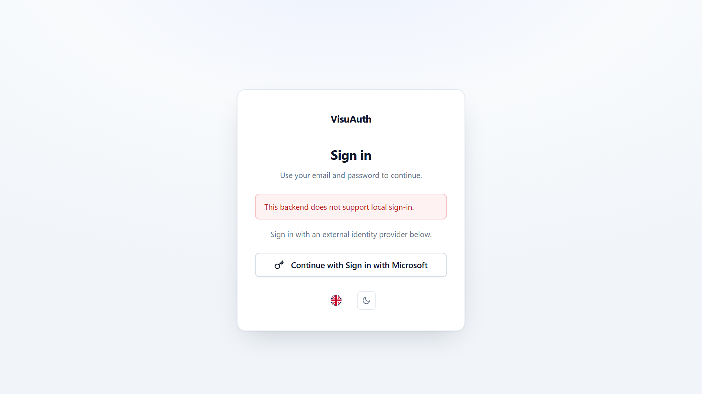

# Microsoft Entra External ID adapter

The `VisuAuth.EntraExternal` adapter targets **Microsoft Entra External ID**
(the Azure AD B2C successor) — customer-facing tenants where end users sign up
and sign in themselves. It feeds the same `/visuauth/admin/*` pages as the other
adapters and shares the Graph wiring with `VisuAuth.Entra` through the
`VisuAuth.EntraCore` package.

> **Workforce vs External.** Pick `VisuAuth.Entra` (Workforce) for *employees of
> your company*; pick `VisuAuth.EntraExternal` for *customers of your SaaS who
> self-onboard*. If users land on a signup page and create their own accounts,
> you want External.

> **Full walkthrough.** This page is an overview. The package READMEs cover the
> end-to-end setup and the customer sign-in wiring:
> [`src/VisuAuth.EntraExternal/README.md`](https://github.com/VisuAuth/VisuAuth/blob/main/src/VisuAuth.EntraExternal/README.md)
> and
> [`src/VisuAuth.EntraExternal.Web/README.md`](https://github.com/VisuAuth/VisuAuth/blob/main/src/VisuAuth.EntraExternal.Web/README.md).

## Install & register

```sh
dotnet add package VisuAuth
dotnet add package VisuAuth.EntraExternal
```

```csharp
using VisuAuth.EntraExternal.DependencyInjection;

builder.Services.AddVisuAuth().AddAdminUi().AddEndUserUi();
builder.Services.AddVisuAuthEntraExternal(builder.Configuration);   // binds VisuAuth:EntraExternal
```

External tenants are **free to create** (unlike Workforce since the 2024 policy
change), making this the lowest-friction path to try VisuAuth against a real
Graph backend. A ~30-line reference lives in `samples/Sample.EntraExternalWebApp`.

## Configuration (`EntraExternalOptions`, bound from `VisuAuth:EntraExternal`)

| Property | Required | Default | Notes |
|---|---|---|---|
| `TenantId` | ✅ | — | Directory (tenant) GUID. |
| `ClientId` | ✅ | — | Application (client) ID of the management app. |
| `ClientSecret` | ✅ | — | The secret **value**. |
| `TenantDomain` | ✅ | — | Initial domain `{tenant}.onmicrosoft.com` — used as the `issuer` when minting a customer's `identities[]` entry. |
| `AppRoleResourceId` | ❌ | `ClientId` | Application ID whose `appRoles` the role store surfaces. |
| `GraphBaseUrl` | ❌ | `…/v1.0` | Sovereign-cloud override. |
| `DefaultEmailDomain` | ❌ | `null` | Suggested Create-User domain (External is permissive — any domain works). |

The same admin-consented Graph application permissions as the Workforce adapter:
`User.Read.All`, `User.ReadWrite.All`, `AppRoleAssignment.ReadWrite.All`,
`Application.Read.All`, plus `UserAuthenticationMethod.ReadWrite.All` for the
reset-2FA operation.

## Capabilities

Mirrors the Workforce adapter's profile — `SupportsLocalLogin = false` (Microsoft
hosts the customer login at `{tenant}.ciamlogin.com`), registration / password
reset / two-factor reset / session revocation / role management (assignment only;
mutation throws), audit log opt-in. The base adapter sets
`SupportsExternalProviders = false` — it doesn't manage federated IdPs itself
(Google, Facebook, Apple are configured at the tenant level and rendered by
Microsoft's hosted page). Once you wire the companion `VisuAuth.EntraExternal.Web`
package (below), it overlays `SupportsExternalProviders = true` so
`/visuauth/login` renders the Microsoft sign-in button.

## Operations

`IUserStore` works against Graph with an `identities[]` shape: list (search
matches `identities/issuerAssignedId`, the customer-typed email), get, create
(`signInType = emailAddress`, `issuer = TenantDomain`), update (DisplayName +
phone only — identities/UPN/mail aren't rewritten from the admin UI, which would
lock the customer out), delete, enable/disable, reset password, reset 2FA, revoke
sessions. `IRoleStore` is identical to the Workforce adapter (app roles are
tenant-family-agnostic in Graph).

## Cursor-based pagination

Graph doesn't return a total count alongside a page, so the user list uses
**cursor-based** pagination — `PagedResult.TotalCount` is null and the admin UI
shows a per-page count with a working "Next" that follows Graph's
`@odata.nextLink`, rather than "page N of M".

## The customer sign-in

The hosted customer OIDC sign-in is wired by the companion
`VisuAuth.EntraExternal.Web` package via `AddVisuAuthEntraExternalSignIn(…)` (it
layers `Microsoft.Identity.Web` under the VisuAuth login page). Without it,
`/visuauth/login` shows only the "use Microsoft" hint — see that package's README.

Because the adapter declares `SupportsLocalLogin = false`, the login page drops
the email/password form on its own and offers the Microsoft hand-off instead —
no template editing, no conditional markup of your own:



That swap is [capability-driven](../concepts/backend-abstraction.md); the admin
dashboard adapts the same way.
