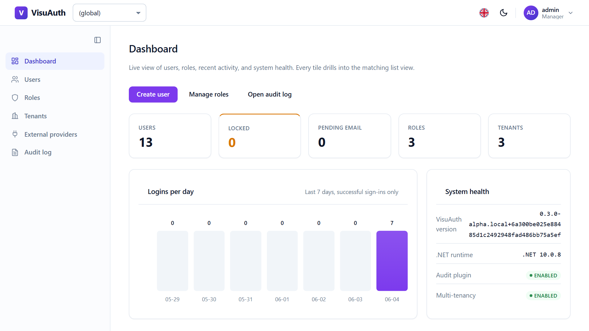
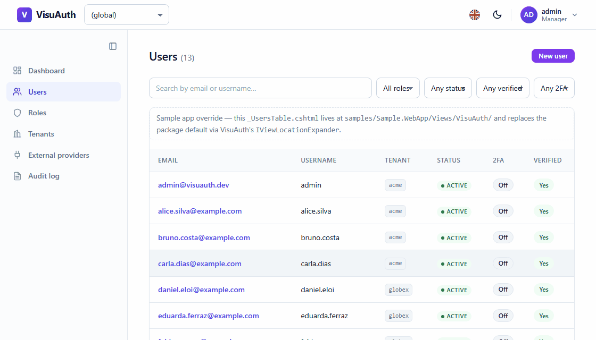
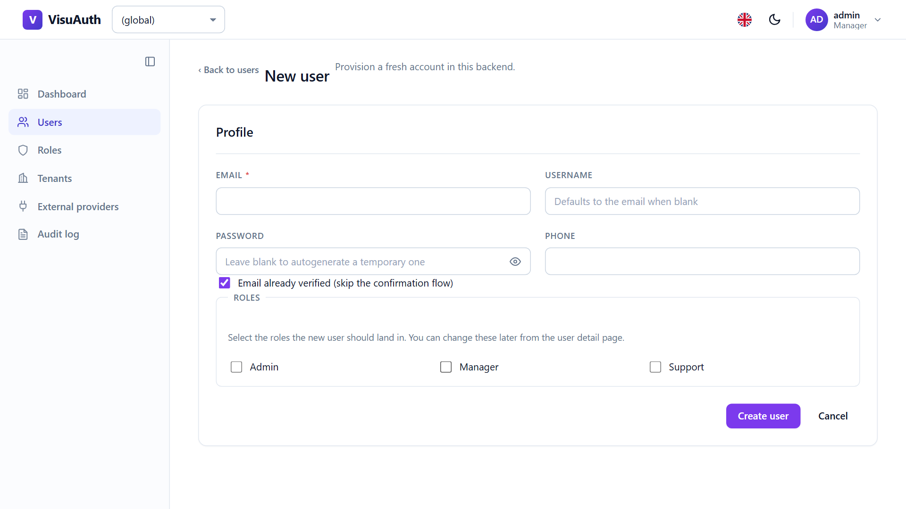
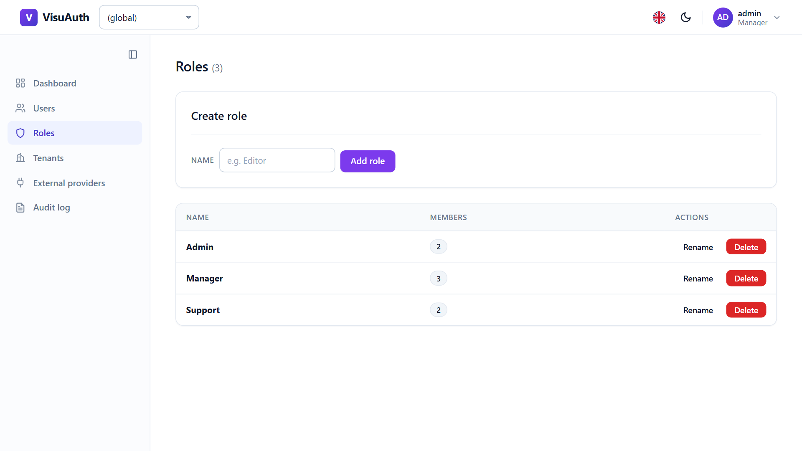
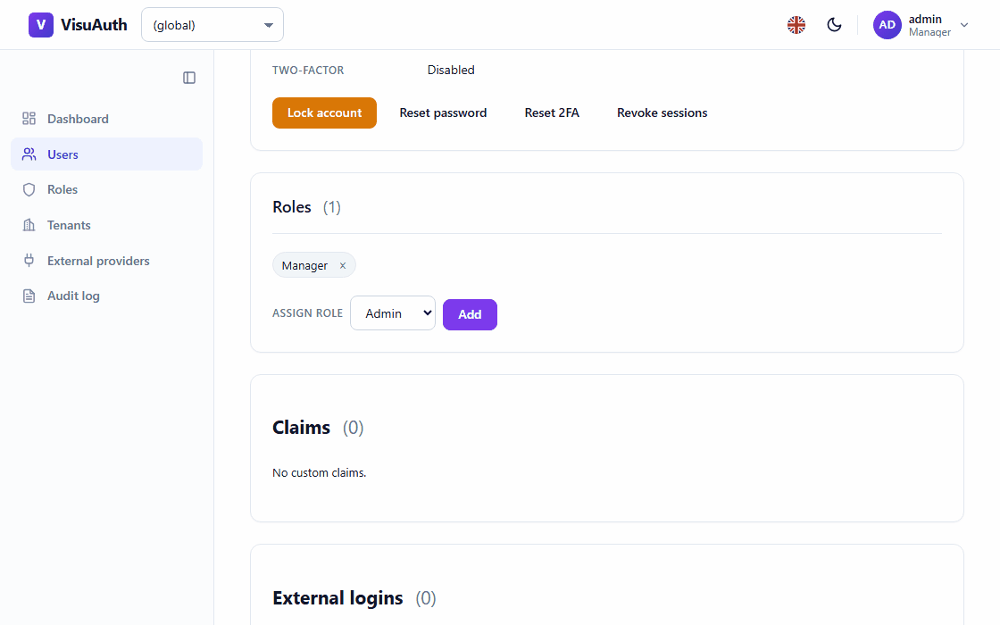
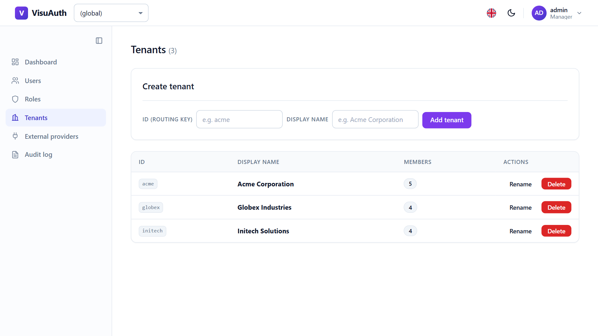
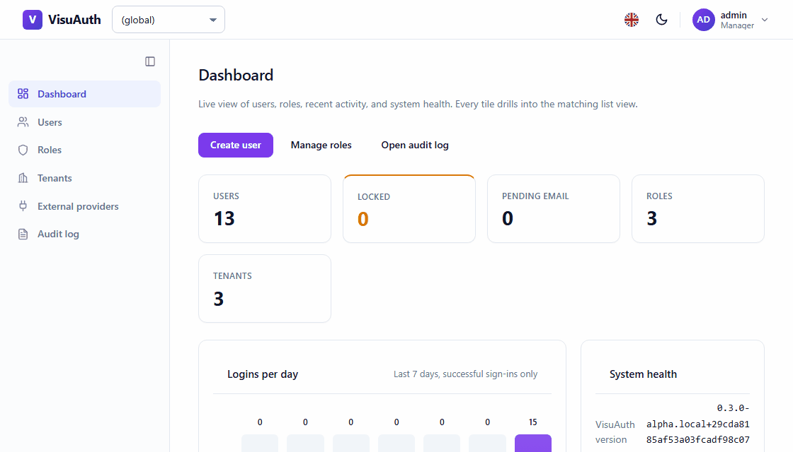
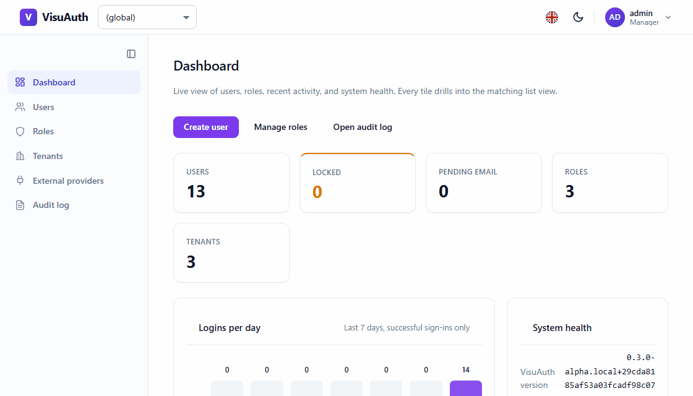

# The admin UI

A tour of everything VisuAuth mounts under `/visuauth/admin`. This is the
dashboard the package exists to give you — the operational surface ASP.NET Core
Identity leaves out.

Everything here is **backend-neutral**: the same pages render over ASP.NET Core
Identity, Microsoft Entra ID, or Entra External ID. The UI consults
[capability flags](concepts/backend-abstraction.md) at runtime and hides what a
backend can't do, so an Entra deployment shows the same user list with the
Lockout and 2FA controls absent instead of broken.

> **The dashboard is protected by default** — every page below requires an
> authenticated user. See [Securing the admin](securing-the-admin.md) for how to
> restrict it to a role, and note that **Entra deployments need an extra
> package** to have anything to sign in with.

## Dashboard — `/visuauth/admin`

The landing page: KPI tiles, a 7-day sign-in chart, a system-health card, and a
recent-activity feed. Tiles are capability-aware, so an Entra-backed deployment
drops the Locked / 2FA / Pending-email tiles automatically.

The activity feed and the chart read from the [audit log](audit-log.md) when it's
enabled; without it they degrade to an empty state rather than an error.

## Users — `/visuauth/admin/users`

Search, filter, and page through users. Search is debounced and swaps only the
table via htmx — no page reload, no JavaScript framework:

Filters cover role, status (active / locked), email-verified, and 2FA-enabled.
Pagination is cursor-based, so a list that changes underneath you doesn't skip
or repeat rows.

### Creating a user — `/visuauth/admin/users/new`

Leave the password blank and VisuAuth generates a policy-compliant temporary one,
shown **once** with a click-to-copy widget:

### User detail — `/visuauth/admin/users/{id}`

Inline profile editing plus the operator actions: lock / unlock, reset password,
reset two-factor, revoke sessions, delete, and role assign / remove. Each action
is capability-gated, so a button only appears when the backend can honour it.

> **Revoke sessions** rotates the user's security stamp. That invalidates their
> cookies *and* their outstanding JWTs — including at the refresh endpoint, so a
> revoked token can't be traded for a fresh one. See
> [Security posture](security.md#session-token-revocation).

## Roles — `/visuauth/admin/roles`

The roles catalogue, with member counts and inline create / rename / delete:

Assigning a role happens inline from the user's detail page:

On backends where roles are declared out-of-band — Entra app roles live in the
app-registration manifest — the mutation controls hide themselves and only
list / assign / remove stay available.

## Tenants — `/visuauth/admin/tenants`

Present once you opt into [multi-tenancy](concepts/multi-tenancy.md). Catalogue
with member counts and inline create / rename / delete:

The sidebar switcher scopes every admin view to one tenant:

> Operators may switch to **any** tenant — the switcher is an operator
> superpower, gated by the admin policy itself rather than per-tenant. Bearer-
> authenticated API callers are bound to the tenant in their signed token and
> cannot cross it. See
> [Security posture](security.md#multi-tenancy).

## External providers — `/visuauth/admin/external-providers`

Configure Google / Microsoft / GitHub / Apple credentials from the UI, stored
encrypted at rest and applied without a restart. Covered in
[External logins](external-logins.md).

## Audit log — `/visuauth/admin/audit-log`

Filterable trail of who did what, from the opt-in audit plugin. Covered in
[Audit log](audit-log.md).

## Adapter configuration — `/visuauth/admin/entra-config`

Present in Entra mode when you opt in: edit the adapter's Graph credentials and
persist them, overlaid on top of `appsettings` / user-secrets. See the
[Entra ID adapter](adapters/entra-id.md).

## Dark mode, for free

The whole dashboard ships light and dark, following the OS by default with a
toggle that persists the visitor's choice:

Re-brand any of it — colours, fonts, logo, whole templates, per tenant — through
the four [theming layers](theming.md).
