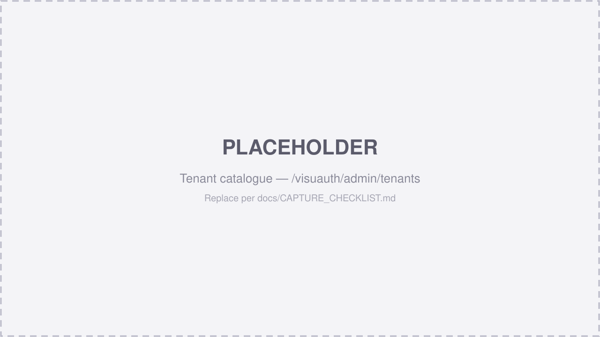

# Multi-tenancy

VisuAuth serves multiple tenants from a single app and database using a
**shared-database, shared-schema** model: a `TenantId` discriminator on the
Identity tables, an EF Core **global query filter** that scopes every query to
the current tenant, and a `SaveChanges` interceptor that stamps `TenantId` on
insert.

Multi-tenancy is **opt-in**. Without it, `ITenantContext.IsMultiTenancyEnabled`
is `false`, the query filters are no-ops, and the tenant catalogue page doesn't
render — single-tenant apps pay nothing.



## Enabling it

Three things change versus the [single-tenant quickstart](../getting-started.md):

**1. Derive your user and DbContext from the multi-tenant base types.**

```csharp
// IdentityUser + IMultiTenantEntity (adds the nullable TenantId column).
public sealed class ApplicationUser : MultiTenantIdentityUser { }

// Applies the global query filter + receives the current tenant context.
public sealed class AppDbContext(
    DbContextOptions<AppDbContext> options,
    ITenantContext tenantContext)
    : MultiTenantIdentityDbContext<ApplicationUser>(options, tenantContext);
```

**2. Opt in when registering VisuAuth, and add the interceptor to the DbContext.**

```csharp
builder.Services.AddVisuAuth()
    .UseAspNetIdentity<ApplicationUser>()
    // The generic overload also wires the tenant catalogue store at
    // /visuauth/admin/tenants.
    .EnableMultiTenant<AppDbContext, ApplicationUser>(options =>
    {
        options.HeaderName = "X-Tenant-Id";   // default
        options.CookieName = "va-tenant";     // default
    })
    .AddAdminUi()
    .AddEndUserUi();

builder.Services.AddDbContext<AppDbContext>((sp, options) =>
{
    options.UseSqlite(builder.Configuration.GetConnectionString("Default"));
    // Stamps TenantId on insert. No-op in single-tenant mode.
    options.AddVisuAuthTenancy(sp);
});
```

**3. Mount the resolver middleware before `MapVisuAuth`.**

```csharp
app.UseVisuAuthTenancy();   // resolves the tenant for each request
app.MapVisuAuth();
```

## Resolving the current tenant

The resolver middleware sets the tenant for each request from `TenantOptions`,
in this precedence:

1. **HTTP header** (`UseHeader`, default on) — `X-Tenant-Id` by default. APIs
   that set the header always win.
2. **Cookie** (`UseCookie`, default on) — `va-tenant` by default. Set by the
   admin sidebar **tenant switcher** for browser flows.

> **Planned.** Subdomain (`UseSubdomain`) and JWT-claim (`UseClaim`,
> `ClaimName = "tenant_id"`) resolution are reserved in `TenantOptions` but not
> yet wired — they land in follow-up releases. Header + cookie ship today.

Set `RequireTenant = true` to reject requests with no resolvable tenant
(HTTP 400); leave it `false` (default) to let global / admin paths run with
`CurrentTenantId = null`.

Anywhere in your app, inspect the ambient tenant via `ITenantContext`:

```csharp
public sealed class MyService(ITenantContext tenant)
{
    public void Work()
    {
        if (tenant.IsMultiTenancyEnabled)
        {
            var id = tenant.CurrentTenantId;             // e.g. "acme"
            var name = tenant.CurrentTenantDisplayName;  // when available
        }
    }
}
```

## How isolation works

- **`IMultiTenantEntity`** (a `string? TenantId` marker) is implemented by
  `MultiTenantIdentityUser`. Any other entity you want scoped implements it too.
- **Global query filter** — `MultiTenantIdentityDbContext<TUser>` adds an EF
  Core filter so every query is automatically restricted to
  `ITenantContext.CurrentTenantId`. You never write `Where(x => x.TenantId == …)`
  by hand.
- **`TenantSaveChangesInterceptor`** — auto-populates `TenantId` on insert, so
  new rows land in the current tenant without app code remembering to set it.

Because isolation lives in the query filter and interceptor, the rest of
VisuAuth (the stores, the admin UI, the end-user pages) is tenant-agnostic — it
just sees the already-scoped data.

## The tenant catalogue

The generic `EnableMultiTenant<TDbContext, TUser>` overload registers
`ITenantStore`, backed by a `VisuAuthTenants` table, and surfaces the catalogue
at **`/visuauth/admin/tenants`** — create, rename, and delete tenants inline.
The admin sidebar's **tenant switcher** writes the `va-tenant` cookie so an
operator can scope the dashboard to one tenant at a time.

## Per-tenant configuration & branding

Once tenancy is on, VisuAuth can vary configuration and appearance per tenant:

- **Branding / theming** — implement `ITenantThemeResolver` (colors, logo) and
  `ITenantViewOverrideResolver` (per-tenant Razor templates). See
  [Theming](../theming.md) (layer 4).
- **Policy** — per-tenant password policy and lockout are resolved through the
  tenant settings layer.

> **Adapters.** Multi-tenancy as described here is the ASP.NET Core Identity
> story. For Microsoft Entra adapters the directory itself *is* the tenant, so
> this per-user `TenantId` model does not apply — see the
> [adapter pages](../adapters/entra-id.md).
