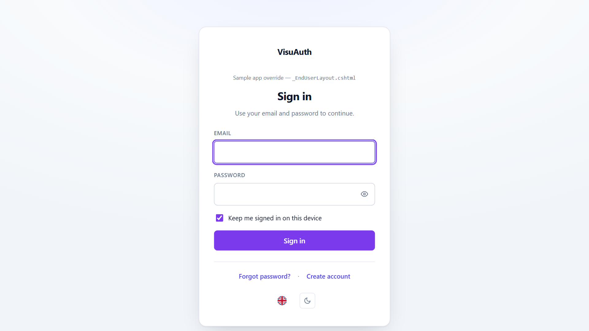
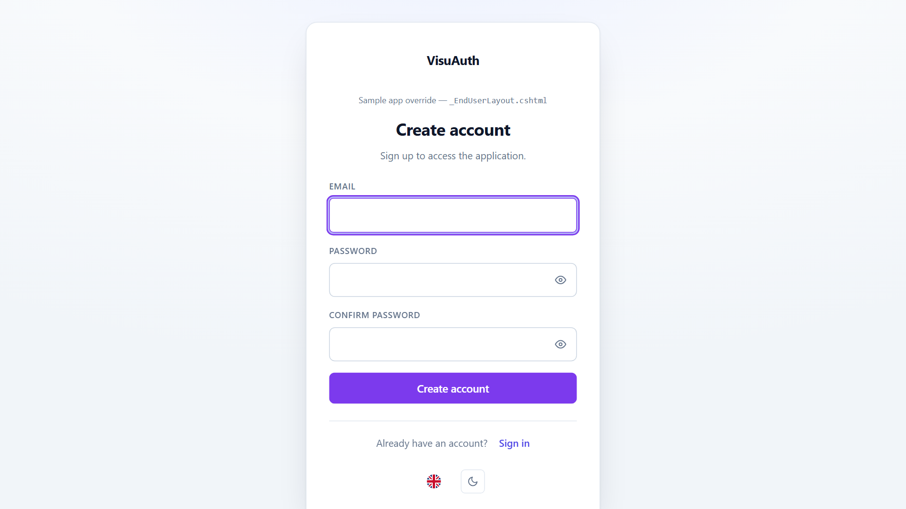

# Getting started

This guide takes you from an empty project to a working `/visuauth/admin` in
four steps. It assumes you are comfortable with ASP.NET Core and EF Core.

> **Prerequisites**
>
> - .NET 10 SDK or later.
> - A project that uses (or will use) **ASP.NET Core Identity** with
>   **EF Core** — SQL Server, PostgreSQL, or SQLite all work.
> - `app.UseStaticFiles()` in the pipeline (almost every app already has it) —
>   VisuAuth ships its CSS and the embedded htmx asset as static web assets.
>
> A complete reference consumer lives in
> [`samples/Sample.WebApp`](https://github.com/VisuAuth/VisuAuth/tree/main/samples/Sample.WebApp);
> it exercises every public surface.

## 1. Install

```bash
dotnet add package VisuAuth
```

That meta-package pulls in `VisuAuth.Abstractions`, `VisuAuth.Identity`,
`VisuAuth.AdminUi`, and `VisuAuth.EndUserUi` as transitive dependencies. Need
only a subset? Install the individual `VisuAuth.*` packages instead.

## 2. Define an Identity user, DbContext, and migrations

Define an Identity user and the DbContext that owns it. The single-tenant form
below is fine even if you plan to opt into multi-tenancy later — swap
`IdentityUser` for `MultiTenantIdentityUser` and `IdentityDbContext<TUser>` for
`MultiTenantIdentityDbContext<TUser>` when you do (see
[Multi-tenancy](concepts/multi-tenancy.md)).

```csharp
public sealed class ApplicationUser : IdentityUser { }

public sealed class AppDbContext(DbContextOptions<AppDbContext> options)
    : IdentityDbContext<ApplicationUser>(options);
```

Create the `AspNet*` tables:

```bash
dotnet ef migrations add Initial
dotnet ef database update
```

> VisuAuth adds **no tables of its own** for the core admin / end-user
> surfaces. Optional plugins are explicit and documented — for example the
> audit-log plugin creates a `VisuAuthAuditLog` table only when you enable it.

## 3. Wire VisuAuth in `Program.cs`

```csharp
using Microsoft.AspNetCore.Identity;
using Microsoft.EntityFrameworkCore;
using VisuAuth;
using VisuAuth.Identity.Authentication;

var builder = WebApplication.CreateBuilder(args);

builder.Services.AddDbContext<AppDbContext>(options =>
    options.UseSqlite(builder.Configuration.GetConnectionString("Default")));

builder.Services
    .AddIdentity<ApplicationUser, IdentityRole>()
    .AddEntityFrameworkStores<AppDbContext>()
    .AddDefaultTokenProviders();

// The drop-in: registers the Identity adapter + admin UI + end-user UI.
builder.Services.AddVisuAuth<ApplicationUser>();

// The end-user sign-in pages and the mobile API issue JWTs, so register an
// issuer. HS256 — the signing key must be at least 32 UTF-8 bytes. Load it
// from configuration or a secret store; never hard-code it.
builder.Services.AddVisuAuthJwt<ApplicationUser>(options =>
{
    options.SigningKey = builder.Configuration["VisuAuth:Jwt:SigningKey"]!;
});

var app = builder.Build();

app.UseStaticFiles();    // serves /_content/VisuAuth.AdminUi/visuauth.css etc.
app.UseRouting();
app.UseAuthentication();
app.UseAuthorization();
app.MapVisuAuth();

app.Run();
```

`AddVisuAuth<ApplicationUser>()` is the drop-in; `AddVisuAuthJwt<ApplicationUser>()`
wires the JWT issuer the end-user pages and the mobile API depend on. No
Node.js, no build step, no Razor file copying, no manual middleware wiring.

> **Why the JWT issuer is required.** Even the web sign-in page mints a JWT (for
> the [WebView / mobile return flow](mobile.md)), so it resolves `IJwtIssuer`
> from DI. Without `AddVisuAuthJwt`, `/visuauth/login` and the
> `/visuauth/api/auth/*` endpoints fail at runtime. The admin dashboard alone
> does not need it.

The snippet above reads a `Default` connection string and a JWT signing key —
add both to `appsettings.json` (SQLite shown; swap the provider to match your
database). The signing key is **your** secret: VisuAuth does not bind it for
you, so in production load it from user-secrets / environment / a vault rather
than committing it:

```json
{
  "ConnectionStrings": {
    "Default": "Data Source=app.db"
  },
  "VisuAuth": {
    "Jwt": {
      "SigningKey": "change-me-to-a-32-byte-or-longer-random-secret"
    }
  }
}
```

### Prefer finer control?

`AddVisuAuth<TUser>()` is the recommended shorthand. The same registration has
a fluent form so you can pick exactly the surfaces you want:

```csharp
builder.Services.AddVisuAuth()
    .UseAspNetIdentity<ApplicationUser>()
    .AddAdminUi()
    .AddEndUserUi();
```

## 4. Try it

Run the app and open:

- **`/visuauth/admin`** — the dashboard.
- **`/visuauth/login`** — the public sign-in page.
- `/visuauth/register`, `/visuauth/forgot-password`,
  `/visuauth/reset-password`, `/visuauth/confirm-email`.





> **Secure the admin before production.** VisuAuth does not impose an
> authorization policy on `/visuauth/admin` — that is the consumer's call.
> Restrict it with your own policy (for example `[Authorize(Roles = "Admin")]`
> via an endpoint convention or a layout filter) before you ship.

## Where to next

| You want to… | Read |
|---|---|
| Understand the contracts adapters implement | [Backend abstraction & capabilities](concepts/backend-abstraction.md) |
| Serve multiple tenants from one app | [Multi-tenancy](concepts/multi-tenancy.md) |
| Re-brand the UI (colors, logo, full view overrides) | [Theming](theming.md) |
| Issue JWTs for a mobile app, or use the WebView flow | [Mobile & JWT](mobile.md) |
| Put the admin UI in front of Microsoft Entra ID | [Microsoft Entra ID adapter](adapters/entra-id.md) |
