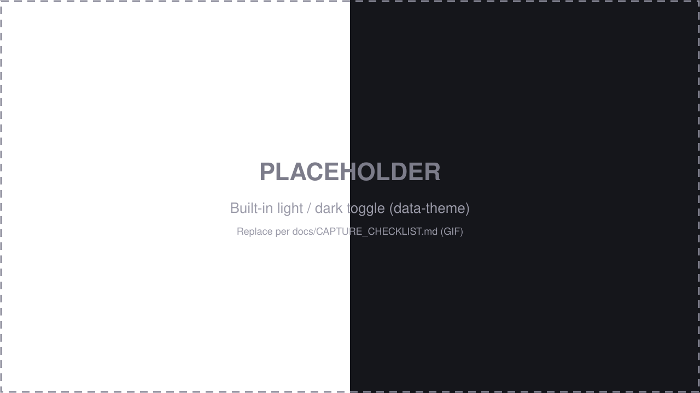
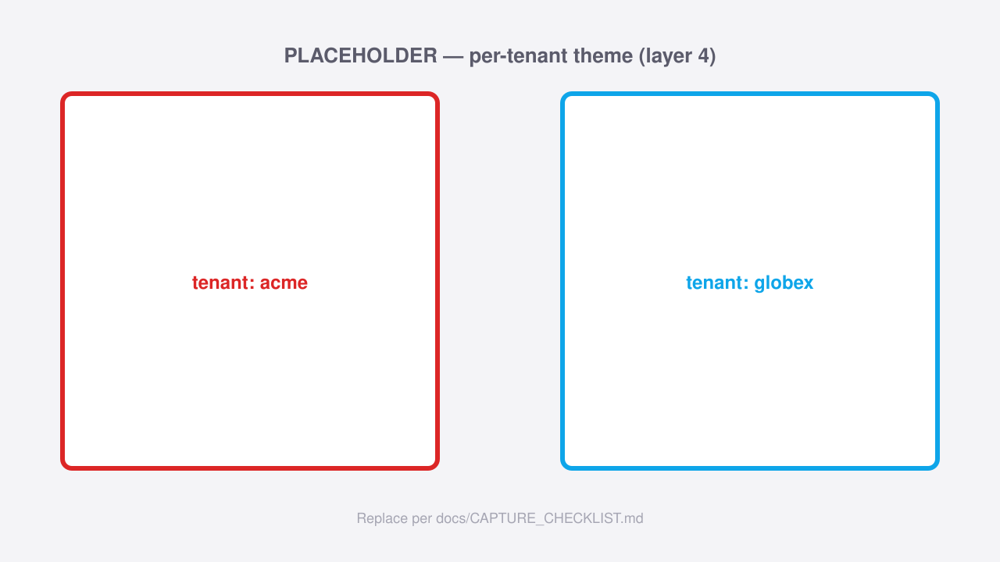

# Theming

VisuAuth ships four layers of customization, ranked from simplest to most
powerful. Each builds on the one before — pick the **lowest layer** that meets
your need. They compose: a CSS token override (layer 1) still applies under a
per-tenant theme (layer 4).

A built-in **light / dark** theme works out of the box: dark mode applies
automatically via `@media (prefers-color-scheme: dark)`, and the header toggle
switches it manually by setting `data-theme="dark"` on the root.



## Layer 1 — CSS custom properties

The simplest customization. VisuAuth's default theme lives in
`wwwroot/visuauth.css` (served at `/_content/VisuAuth.AdminUi/visuauth.css`) and
is driven entirely by CSS custom properties. Override any of them in your own
stylesheet, loaded **after** VisuAuth's, and the cascade does the rest — no fork,
no rebuild.

```css
/* your-site.css, loaded after visuauth.css */
:root {
  --visuauth-primary: #7c3aed;     /* brand fill / focus */
  --visuauth-primary-fg: #ffffff;  /* text on the brand fill */
  --visuauth-radius: 0.75rem;      /* corner radius */
}
```

The tokens (defaults in parentheses):

| Token | Role |
|---|---|
| `--visuauth-primary` (`#6366f1`) | Brand fill, focus ring |
| `--visuauth-primary-hover` / `-active` | Hover / pressed brand states |
| `--visuauth-primary-fg` (`#ffffff`) | Text on the brand fill |
| `--visuauth-primary-soft` / `-soft-fg` | Tinted surface + its text |
| `--visuauth-bg` (`#ffffff`) | Page / card background |
| `--visuauth-fg` | Base text colour |
| `--visuauth-muted` | Secondary text |
| `--visuauth-border` | Borders |
| `--visuauth-surface` | Table headers, sidebar, hover rows |
| `--visuauth-danger` / `--visuauth-success` | Status colours |
| `--visuauth-radius` | Corner radius |
| `--visuauth-font` | Font stack |

> To override **dark mode** specifically, scope your overrides to
> `:root[data-theme="dark"]` (and/or the `prefers-color-scheme: dark` media
> query) so they only apply in dark mode.

## Layer 2 — programmatic config (`VisuAuthTheme`)

When the brand comes from configuration rather than a stylesheet, set the tokens
in code. VisuAuth renders a `:root { … }` block right after the default
stylesheet (via the `<va-theme-style />` tag helper), so your values win without
touching CSS.

```csharp
services.AddVisuAuth<ApplicationUser>();
services.Configure<VisuAuthTheme>(theme =>
{
    theme.Primary   = "#7c3aed";
    theme.PrimaryFg = "#ffffff";
    theme.Radius    = "0.75rem";
});
```

Every `VisuAuthTheme` property is nullable and maps to one token — `Primary`,
`PrimaryFg`, `Bg`, `Fg`, `Muted`, `Border`, `Surface`, `Danger`, `Success`,
`Radius`, `Font`. Anything left `null` or blank falls through to the layer-1
default in `visuauth.css`.

## Layer 3 — Razor view overrides

For structural changes beyond colours, replace VisuAuth's views with your own.
Drop a same-named `.cshtml` into the override folder (default `/Views/VisuAuth`,
configurable) and VisuAuth falls back to its built-in copy when yours is absent.

```csharp
services.Configure<VisuAuthViewOverrideOptions>(o =>
{
    o.Root = "/Areas/MyBrand/Views";   // anywhere under the host project
});
```

Two cooperating mechanisms make this work, with **no extra registration** for
the consumer page:

- A **view-location expander** prepends `{Root}/{name}.cshtml` and
  `{Root}/Shared/{name}.cshtml` to Razor's search list, so partials and layouts
  (`_Layout`, `_EndUserLayout`) resolve your copy first.
- A **page-demotion convention** lowers the route priority of every VisuAuth
  Razor Page, so a consumer Razor Page in the host app declaring the same
  `@page "/visuauth/login"` route wins via the lower-order-wins rule.

## Layer 4 — per-tenant overrides

With [multi-tenancy](concepts/multi-tenancy.md) on, vary both theme and
templates per tenant at request time. Implement either or both resolver
contracts; the default registrations are no-ops that return `null`, so consumers
who never opt in keep the fast path.



**Per-tenant theme** — `ITenantThemeResolver` returns a `VisuAuthTheme?` keyed
off the current tenant. VisuAuth overlays it on the global layer-2 theme via
`VisuAuthThemeMerger.Merge`: a non-blank tenant property wins, the global theme
fills the rest, and anything still null falls through to the CSS default. So a
resolver can change just `Primary` per tenant and inherit every shared neutral.

```csharp
services.AddSingleton<ITenantThemeResolver, MyTenantThemeResolver>();

public sealed class MyTenantThemeResolver : ITenantThemeResolver
{
    public Task<VisuAuthTheme?> ResolveAsync(string? tenantId, CancellationToken ct = default)
        => Task.FromResult(tenantId switch
        {
            "acme"   => new VisuAuthTheme { Primary = "#dc2626" },
            "globex" => new VisuAuthTheme { Primary = "#0ea5e9" },
            _        => null,   // fall back to the global theme
        });
}
```

**Per-tenant views** — `ITenantViewOverrideResolver.ResolveOverrideRoot(tenantId)`
returns a per-tenant folder (e.g. `/Views/VisuAuth/Tenants/acme`) that's probed
**before** the global layer-3 root and the package defaults, so markup can vary
per tenant.

> Use `AddSingleton` for a stateless lookup, or `AddScoped` when the resolver
> needs per-request services. The view resolver is **synchronous** because
> Razor's view-location pipeline is sync — cache any database lookups behind it,
> as the expander asks on every render.

> **Per-tenant whole-page overrides** (a different consumer Razor Page per tenant
> at the *same* route) need a custom endpoint-selector policy and are out of
> scope — layer 4 covers per-tenant themes and partial/layout templates.
